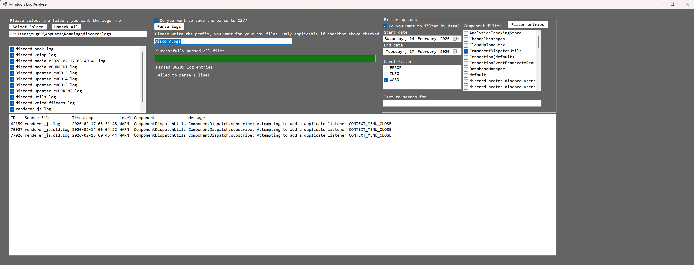

# Minitug's LogFileAnalyser

A WinForms C# application that parses log files, assigns unique IDs to entries, and exports structured CSV data for analysis. Designed to make exploring log files easier with filtering and search functionality.

## Features
- Parse multiple `.log` files from a folder  
- Extract key fields: **Timestamp**, **Level**, **Component**, **Message**, **Source file**  
- Handle multiple Discord log formats and previously failing lines  
- Assign sequential IDs to each log entry  
- Export parsed entries to a structured CSV file  
- Filter logs by:  
  - **Log Level** (INFO, WARN, ERROR, etc.)  
  - **Component**  
  - **Date range**  
  - **Text search** in messages and components  
- Persist user selections for filters for consistent workflow  

## Tech Stack
- C#  
- WinForms  
- .NET 10  
- System.IO  
- Regex  

## Usage
1. Select a folder containing `.log` files.  
2. Choose which files to include.  
3. Apply optional filters: **Level**, **Component**, **Date range**, or **Text search**.  
4. Parse logs and preview results in the grid.  
5. Export filtered results to CSV for analysis.  

## Potential Future Plans
- Graphical summaries and plotting (error timelines, top modules, etc.)  
- SQLite backend for storing multiple logs and enabling faster queries  
- Live folder monitoring and auto-refresh  

*Tested with ~98k log entries successfully parsed.*

GUI Preview:

